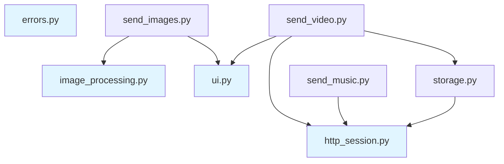

The `media_types/` package provides a unified interface for processing and sending media from any video source (TikTok, Instagram, future sources).

## Package Structure

The package is split into focused modules with clear dependencies:

```
media_types/
├── __init__.py              # Public API exports
├── http_session.py          # Shared aiohttp session
├── image_processing.py      # PIL/HEIF conversion
├── ui.py                    # Keyboard and caption helpers
├── errors.py                # Error-to-message mapping
├── storage.py               # Telegram storage channel uploads
├── send_video.py            # Video sending logic
├── send_music.py            # Music sending logic
└── send_images.py           # Slideshow download and sending
```

**Dependency graph (no cycles):**



Standalone modules (no dependencies) are highlighted in blue.

## HTTP Session Management

### Shared Session Pool

A single aiohttp session is shared across all media operations:

```python
# media_types/http_session.py

_http_session: aiohttp.ClientSession | None = None
_HTTP_TIMEOUT = ClientTimeout(total=30, connect=10, sock_read=20)

def _get_http_session() -> aiohttp.ClientSession:
    global _http_session
    if _http_session is None or _http_session.closed:
        connector = aiohttp.TCPConnector(
            limit=100,              # Total connection limit
            limit_per_host=20,      # Per-host limit
            ttl_dns_cache=300,      # DNS cache TTL
            enable_cleanup_closed=True,
        )
        _http_session = aiohttp.ClientSession(
            timeout=_HTTP_TIMEOUT,
            connector=connector,
            headers={"User-Agent": "Mozilla/5.0"},
        )
    return _http_session
```

**Cleanup on shutdown:**

```python
async def close_http_session() -> None:
    global _http_session
    if _http_session is not None and not _http_session.closed:
        await _http_session.close()
        _http_session = None
```

Called from `main.py` shutdown handler:

```python
from media_types import close_http_session

try:
    await dp.start_polling(bot)
finally:
    await close_http_session()
```

### Download with Retry

All URL downloads use retry logic with exponential backoff:

```python
async def _download_url(
    url: str, max_retries: int = 3, retry_delay: float = 1.0
) -> bytes | None:
    session = _get_http_session()
    
    for attempt in range(1, max_retries + 1):
        try:
            async with session.get(URL(url, encoded=True), allow_redirects=True) as response:
                if response.status == 200:
                    return await response.read()
                
                if response.status not in _RETRYABLE_STATUSES:  # 429, 500, 502, 503, 504
                    return None
                
                logger.warning(f"Retryable status {response.status} (attempt {attempt}/{max_retries})")
        except Exception as e:
            logger.warning(f"Download exception (attempt {attempt}/{max_retries}): {e}")
        
        if attempt < max_retries:
            await asyncio.sleep(retry_delay)
    
    return None
```

### Thumbnail Download

```python
async def download_thumbnail(
    cover_url: str | None, video_id: int
) -> BufferedInputFile | None:
    if not cover_url:
        return None
    
    cover_bytes = await _download_url(cover_url, max_retries=1)
    if cover_bytes:
        return BufferedInputFile(cover_bytes, f"{video_id}_thumb.jpg")
    return None
```

## Image Processing

### Format Detection

Detects image format from magic bytes:

```python
def detect_image_format(image_data: bytes) -> str:
    if image_data.startswith(b"\xff\xd8\xff"):
        return ".jpg"
    if image_data.startswith(b"\x89PNG"):
        return ".png"
    if image_data.startswith(b"RIFF") and image_data[8:12] == b"WEBP":
        return ".webp"
    if image_data[4:12] in (b"ftypheic", b"ftypmif1"):
        return ".heic"
    return ".jpg"  # Default fallback
```

### HEIF/HEIC Conversion

Telegram doesn't support HEIC natively, so we convert to JPEG:

```python
try:
    from PIL import Image
    import pillow_heif
    
    pillow_heif.register_heif_opener()  # Register HEIF opener once at module load
    IMAGE_CONVERSION_AVAILABLE = True
except ImportError:
    IMAGE_CONVERSION_AVAILABLE = False

_NATIVE_EXTENSIONS = {".jpg", ".webp", ".png"}  # Telegram-supported formats

def convert_image_to_jpeg_optimized(image_data: bytes) -> bytes:
    """Convert any image format to optimized JPEG."""
    try:
        with Image.open(io.BytesIO(image_data)) as img:
            # Handle transparency
            if img.mode == "RGBA":
                background = Image.new("RGB", img.size, (255, 255, 255))
                background.paste(img, mask=img.split()[3])
                img = background
            elif img.mode != "RGB":
                img = img.convert("RGB")

            output = io.BytesIO()
            img.save(
                output,
                format="JPEG",
                quality=75,          # Balanced quality/size
                optimize=False,      # Skip optimization for speed
                subsampling=2,       # 4:2:0 chroma subsampling
                progressive=False,   # Non-progressive for compatibility
            )
            return output.getvalue()
    except Exception as e:
        logger.error(f"Image to JPEG conversion failed: {e}")
        return image_data  # Return original on error
```

### Process Pool Executor

Image conversion runs in a separate process to avoid blocking:

```python
# Persistent executor to prevent shutdown errors under high load
_image_executor: concurrent.futures.ProcessPoolExecutor | None = None

def get_image_executor() -> concurrent.futures.ProcessPoolExecutor:
    global _image_executor
    if _image_executor is None:
        _image_executor = concurrent.futures.ProcessPoolExecutor(max_workers=4)
    return _image_executor
```

**Usage:**

```python
loop = asyncio.get_running_loop()
executor = get_image_executor()

img_bytes = await loop.run_in_executor(
    executor, convert_image_to_jpeg_optimized, img_bytes
)
```

## Video Processing

### Send Video Result

```python
async def send_video_result(
    targed_id: int | str,
    video_info: VideoInfo,
    lang: str,
    file_mode: bool,
    inline_message: bool = False,
    reply_to_message_id: int | None = None,
    user_id: int | None = None,
    username: str | None = None,
    full_name: str | None = None,
) -> None:
    video_id = video_info.id
    video_data = video_info.data
    video_duration = video_info.duration

    # Inline mode requires file_id (upload to storage first)
    if inline_message:
        thumbnail = None
        if video_duration and video_duration > 30:
            thumbnail = await download_thumbnail(video_info.cover, video_id)

        file_id = await upload_video_to_storage(
            video_data, video_info, user_id, username, full_name, thumbnail=thumbnail
        )
        
        video_media = InputMediaVideo(
            media=file_id,
            caption=result_caption(lang, video_info.link),
            width=video_info.width,
            height=video_info.height,
            duration=video_duration,
            supports_streaming=True,
        )
        await bot.edit_message_media(inline_message_id=targed_id, media=video_media)
        return

    # Regular message
    if isinstance(video_data, bytes):
        video_file = BufferedInputFile(video_data, filename=f"{video_id}.mp4")
    else:
        video_file = video_data  # Already a file object

    if file_mode:
        # Send as document
        await bot.send_document(
            chat_id=targed_id,
            document=video_file,
            caption=result_caption(lang, video_info.link),
            reply_markup=music_button(video_id, lang),
            reply_to_message_id=reply_to_message_id,
            disable_content_type_detection=True,
        )
    else:
        # Send as video with thumbnail
        thumbnail = None
        if video_duration and video_duration > 60:
            thumbnail = await download_thumbnail(video_info.cover, video_id)

        await bot.send_video(
            chat_id=targed_id,
            video=video_file,
            caption=result_caption(lang, video_info.link),
            height=video_info.height,
            width=video_info.width,
            duration=video_duration,
            thumbnail=thumbnail,
            supports_streaming=True,
            reply_markup=music_button(video_id, lang),
            reply_to_message_id=reply_to_message_id,
        )
```

**Location:** `media_types/send_video.py:11-92`

### Storage Channel Upload

Inline mode requires file_id (Telegram won't accept new uploads), so videos are uploaded to a storage channel first:

```python
async def upload_video_to_storage(
    video_data: bytes,
    video_info: VideoInfo,
    user_id: int | None,
    username: str | None,
    full_name: str | None,
    thumbnail: BufferedInputFile | None = None,
) -> str | None:
    """Upload video to storage channel and return file_id."""
    storage_channel_id = config["bot"]["storage_channel_id"]
    if not storage_channel_id:
        logger.error("STORAGE_CHANNEL_ID not configured")
        return None

    video_file = BufferedInputFile(video_data, filename=f"{video_info.id}.mp4")
    
    caption = f"User: {full_name} (@{username}, {user_id})\nLink: {video_info.link}"
    
    message = await bot.send_video(
        chat_id=storage_channel_id,
        video=video_file,
        caption=caption,
        thumbnail=thumbnail,
        supports_streaming=True,
    )
    
    return message.video.file_id if message.video else None
```

**Configuration:**
```bash
STORAGE_CHANNEL_ID=-1001234567890  # Required for inline mode
```

## Image Processing (Slideshows)

### Send Image Result

```python
async def send_image_result(
    user_msg,
    video_info: VideoInfo,
    lang: str,
    file_mode: bool,
    image_limit: int | None,
    client: TikTokClient,
) -> bool:
    """Send slideshow images to the user.
    
    Returns True if image processing (conversion) was performed.
    """
    video_id = video_info.id
    image_urls = video_info.image_urls
    
    if image_limit:
        image_urls = image_urls[:image_limit]
    
    # Download all images with retry
    proxy_session = video_info._proxy_session
    if proxy_session:
        all_image_bytes = await client.download_slideshow_images(
            video_info, proxy_session
        )
        if image_limit:
            all_image_bytes = all_image_bytes[:image_limit]
    else:
        # Fallback to legacy parallel download
        all_image_bytes = await download_images_parallel(
            image_urls, client, video_info
        )
```

**Location:** `media_types/send_images.py:42-212`

### Batch Processing with Conversion

```python
# Split into batches of 10 for Telegram media groups
images_bytes = [
    all_image_bytes[x : x + 10]
    for x in range(0, len(all_image_bytes), 10)
]

# Check if processing is needed (only for photo mode)
if not file_mode and all_image_bytes:
    first_image = all_image_bytes[0]
    extension = detect_image_format(first_image)
    processing_needed = extension not in _NATIVE_EXTENSIONS

# Show processing message if converting
if processing_needed and is_private_chat:
    processing_message = await user_msg.reply(locale[lang]["processing"])

loop = asyncio.get_running_loop()
executor = get_image_executor()

for num, part_bytes in enumerate(images_bytes):
    media_group = []
    
    for img_bytes in part_bytes:
        extension = detect_image_format(img_bytes)
        
        if file_mode:
            # Send as document (no conversion)
            filename = f"{video_id}_{current_image_number}{extension}"
            buffered = BufferedInputFile(img_bytes, filename)
            media_group.append(
                InputMediaDocument(
                    media=buffered, disable_content_type_detection=True
                )
            )
        else:
            # Convert non-native formats to JPEG
            if IMAGE_CONVERSION_AVAILABLE and extension not in _NATIVE_EXTENSIONS:
                try:
                    img_bytes = await loop.run_in_executor(
                        executor, convert_image_to_jpeg_optimized, img_bytes
                    )
                    extension = ".jpg"
                except Exception as e:
                    logger.error(f"Failed to convert image: {e}")
            
            filename = f"{video_id}_{current_image_number}{extension}"
            buffered = BufferedInputFile(img_bytes, filename)
            media_group.append(
                InputMediaPhoto(
                    media=buffered, disable_content_type_detection=True
                )
            )
    
    await user_msg.reply_media_group(media_group, disable_notification=True)
```

**Key points:**
- Downloads all images first (with retry per image)
- Detects format for each image
- Converts HEIC→JPEG only in photo mode (not file mode)
- Sends in batches of 10 (Telegram media group limit)
- Shows "Processing..." message during conversion

## Music Processing

### Send Music Result

```python
async def send_music_result(
    query_msg, music_info: MusicInfo, lang: str, group_chat: bool
) -> None:
    video_id = music_info.id
    audio_data = music_info.data
    cover_url = music_info.cover

    # Download audio if URL
    if isinstance(audio_data, bytes):
        audio_bytes = audio_data
    else:
        downloaded = await _download_url(audio_data)
        if downloaded is None:
            raise ValueError(f"Failed to download audio from {audio_data}")
        audio_bytes = downloaded

    # Download cover art
    cover_bytes = await _download_url(cover_url) if cover_url else None

    audio = BufferedInputFile(audio_bytes, f"{video_id}.mp3")
    cover = BufferedInputFile(cover_bytes, f"{video_id}.jpg") if cover_bytes else None

    await query_msg.reply_audio(
        audio,
        caption=f"<b>{locale[lang]['bot_tag']}</b>",
        title=music_info.title,
        performer=music_info.author,
        duration=music_info.duration,
        thumbnail=cover,
        disable_notification=group_chat,
    )
```

**Location:** `media_types/send_music.py:9-38`

## Error Mapping

Extensible error-to-message mapping allows any module to register errors:

```python
# media_types/errors.py

_error_mappings: dict[type, str] = {}

def register_error_mapping(exception_class: type, message_key: str) -> None:
    """Register an exception class to localized message key mapping."""
    _error_mappings[exception_class] = message_key

def get_error_message(error: Exception, lang: str) -> str:
    """Get localized error message for an exception."""
    error_type = type(error)
    
    # Check for exact match
    if error_type in _error_mappings:
        message_key = _error_mappings[error_type]
        return locale[lang].get(message_key, locale[lang]["error"])
    
    # Check for parent classes
    for exc_class, message_key in _error_mappings.items():
        if isinstance(error, exc_class):
            return locale[lang].get(message_key, locale[lang]["error"])
    
    # Default error message
    return locale[lang]["error"]
```

**Auto-registration at import:**

```python
# instagram_api/__init__.py
from media_types.errors import register_error_mapping
from .exceptions import (
    InstagramNotFoundError,
    InstagramNetworkError,
    InstagramRateLimitError,
)

register_error_mapping(InstagramNotFoundError, "error_instagram_not_found")
register_error_mapping(InstagramNetworkError, "error_network")
register_error_mapping(InstagramRateLimitError, "error_rate_limit")
```

## UI Helpers

### Result Caption

```python
def result_caption(lang: str, link: str, preview: bool = False) -> str:
    """Generate result caption with source link."""
    preview_text = f" {locale[lang]['preview']}" if preview else ""
    return f"<b>{locale[lang]['bot_tag']}</b>{preview_text}\n{link}"
```

### Music Button

```python
def music_button(video_id: int, lang: str) -> InlineKeyboardMarkup:
    """Generate inline keyboard with music extraction button."""
    return InlineKeyboardMarkup(
        inline_keyboard=[
            [
                InlineKeyboardButton(
                    text=locale[lang]["music_button"],
                    callback_data=f"music_{video_id}",
                )
            ]
        ]
    )
```

## Resource Cleanup

All media processing resources are cleaned up on shutdown:

```python
# In main.py
try:
    await dp.start_polling(bot)
finally:
    # Cleanup shared resources
    await TikTokClient.close_curl_session()  # curl_cffi sessions
    await TikTokClient.close_connector()     # aiohttp connector
    TikTokClient.shutdown_executor()         # ThreadPoolExecutor
    await close_http_session()               # media_types aiohttp session
```

## Performance Considerations

1. **Shared session pools** - Reuse TCP connections across requests
2. **Process pool for images** - Avoid blocking event loop during conversion
3. **Batch downloads** - Download all slideshow images in parallel
4. **Individual retry** - Failed images retry independently, not entire batch
5. **Lazy conversion** - Only convert non-native formats (HEIC)
6. **Conditional thumbnails** - Only download for videos >60s

## Related Components

- [3-Part Retry Strategy](/architecture/retry-strategy) - Image download retry logic
- [Architecture Overview](/architecture/overview) - Component relationships
- **Source:** `media_types/` directory (all modules)
