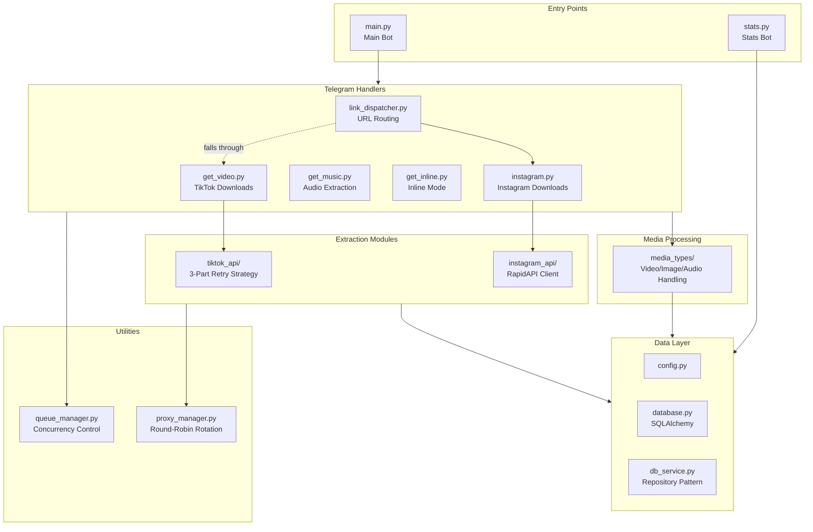
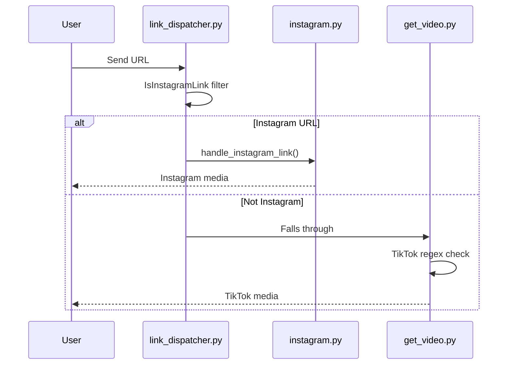
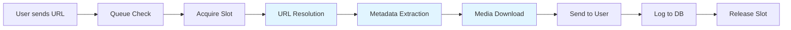
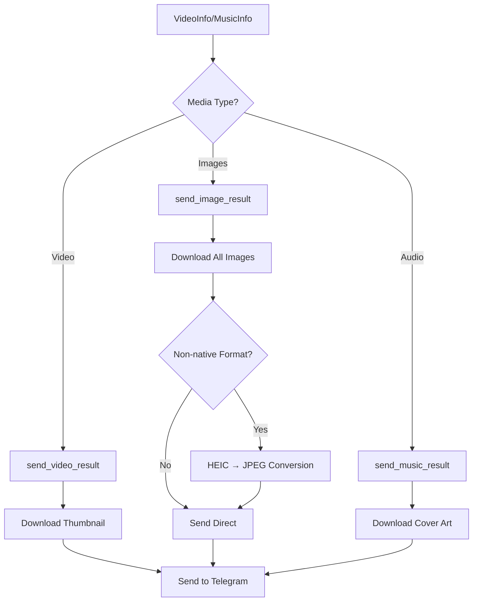

TT-Bot is a production-grade Telegram bot built with a modular, layered architecture designed for reliability, extensibility, and high throughput.

## Tech Stack

- **Python 3.13** with strict async/await throughout
- **aiogram 3.24** for Telegram Bot API
- **yt-dlp** for TikTok metadata extraction
- **curl_cffi** for browser-impersonated HTTP requests
- **SQLAlchemy 2.0 + asyncpg** for database
- **aiohttp** for async HTTP client operations

## High-Level Architecture



## Core Design Patterns

### 1. Modular Package Structure

The codebase is organized into focused packages with clear responsibilities:

- **`handlers/`** - Telegram message/callback handlers (aiogram routers)
- **`tiktok_api/`** - TikTok extraction with retry logic
- **`instagram_api/`** - Instagram extraction via RapidAPI
- **`media_types/`** - Shared media processing (video/image/audio sending)
- **`data/`** - Configuration, database, localization
- **`misc/`** - Queue management and utilities
- **`stats/`** - Statistics bot and graph generation

### 2. Singleton Resource Pattern

Shared resources are pooled at the class level to maximize throughput:

```python
class TikTokClient:
    # Shared ThreadPoolExecutor for sync yt-dlp calls
    _executor: ThreadPoolExecutor = None  # 500 workers
    
    # Shared aiohttp connector for URL resolution
    _aiohttp_connector: TCPConnector = None
    
    # Shared curl_cffi session pool (keyed by proxy)
    _curl_session_pool: dict[proxy, CurlAsyncSession] = {}  # 1000 clients each
```

Resources are lazily initialized on first use and properly cleaned up on shutdown:

```python
# In main.py shutdown handler
await TikTokClient.close_curl_session()
await TikTokClient.close_connector()
TikTokClient.shutdown_executor()
await close_http_session()
```

### 3. Repository Pattern

Database operations are abstracted through `db_service.py`, providing a clean interface:

```python
# handlers/ interact with db_service, not models directly
from data.db_service import (
    create_user_if_not_exists,
    log_video_download,
    get_user_language,
)
```

### 4. Context Managers (RAII)

`VideoInfo` implements context manager protocol for automatic resource cleanup:

```python
async with await client.video(url) as video_info:
    # Use video_info
    # Automatically calls video_info.close() on exit
```

This is critical for slideshows, which must release yt-dlp resources.

### 5. Extensible Error Mapping

New video sources register their errors at import time:

```python
# In instagram_api/__init__.py
from media_types.errors import register_error_mapping
from .exceptions import InstagramNotFoundError

register_error_mapping(InstagramNotFoundError, "error_instagram_not_found")
```

Handlers use a unified error interface:

```python
from media_types import get_error_message

try:
    await client.get_media(url)
except Exception as e:
    message = get_error_message(e, lang)
```

## Component Relationships

### Handler Registration Order

Router order matters in aiogram. Registration in `main.py`:

```python
dp.include_routers(
    user_router,      # /start, /mode commands
    lang_router,      # /lang command
    admin_router,     # Admin commands
    advert_router,    # Broadcast system
    link_router,      # Instagram URL interception
    video_router,     # TikTok URLs (fallthrough from link_router)
    music_router,     # Music button callbacks
    inline_router,    # Inline queries
    slideshow_router, # Inline slideshow pagination
)
```

**Critical:** `link_router` must come before `video_router` to intercept Instagram URLs.

### URL Dispatch Flow



## Data Flow

### Video Download Pipeline



Each blue stage (D, E, F) has independent retry logic with proxy rotation.

### Media Processing Pipeline



## Configuration Management

Configuration is loaded from environment variables in `data/config.py`:

```python
config = {
    "bot": {
        "token": os.getenv("BOT_TOKEN"),
        "db_url": os.getenv("DB_URL"),
    },
    "retry": {
        "url_resolve_max_retries": int(os.getenv("URL_RESOLVE_MAX_RETRIES", 3)),
        "video_info_max_retries": int(os.getenv("VIDEO_INFO_MAX_RETRIES", 3)),
        "download_max_retries": int(os.getenv("DOWNLOAD_MAX_RETRIES", 3)),
    },
    "proxy": {
        "proxy_file": os.getenv("PROXY_FILE"),
        "include_host": os.getenv("INCLUDE_HOST", "false").lower() == "true",
    },
    # ... other sections
}
```

## Concurrency Control

`QueueManager` implements per-user concurrency limits:

```python
from misc.queue_manager import QueueManager

queue_manager = QueueManager.get_instance()

# Check before acquiring
if queue_manager.get_user_queue_size(user_id) >= max_queue:
    await message.reply(locale[lang]["queue_full"])
    return

# Acquire slot
async with queue_manager.info_queue(user_id):
    # Process request
    video_info = await client.video(url)
    # Slot automatically released on exit
```

## Anti-Bot Measures

### Chrome 120 Impersonation

TikTok's WAF blocks datacenter IPs and detects bot fingerprints. The solution:

```python
TIKTOK_IMPERSONATE_TARGET = "chrome120"  # Fixed to Chrome 120
TIKTOK_USER_AGENT = "Mozilla/5.0 ... Chrome/120.0.0.0 ..."  # Must match
```

**Why Chrome 120?** Newer versions (136+) are blocked when used with proxies due to TLS fingerprint mismatches.

Implementation:
- **yt-dlp:** `ImpersonateTarget("chrome", "120", "macos", None)`
- **curl_cffi:** `impersonate="chrome120"`
- **Headers:** User-Agent must match impersonation target

## Key Files Reference

| File | Purpose | Lines |
|------|---------|-------|
| `main.py` | Bot entry point, router registration, cleanup | 61 |
| `tiktok_api/client.py` | Core TikTok extraction with 3-part retry | 1960 |
| `tiktok_api/proxy_manager.py` | Round-robin proxy rotation | 176 |
| `handlers/link_dispatcher.py` | URL routing (Instagram vs TikTok) | ~100 |
| `media_types/send_video.py` | Video sending logic | 92 |
| `media_types/send_images.py` | Slideshow download and sending | 212 |
| `data/db_service.py` | Repository pattern database operations | ~400 |
| `misc/queue_manager.py` | Per-user concurrency control | ~200 |

For specific component details, see:
- [3-Part Retry Strategy](/architecture/retry-strategy)
- [Proxy Rotation](/architecture/proxy-rotation)
- [Media Processing](/architecture/media-processing)
