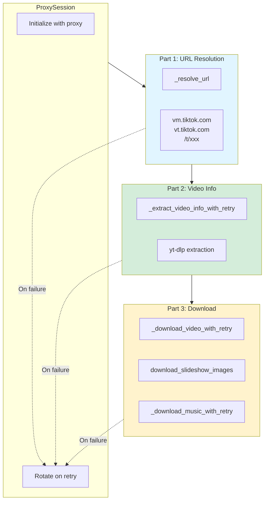
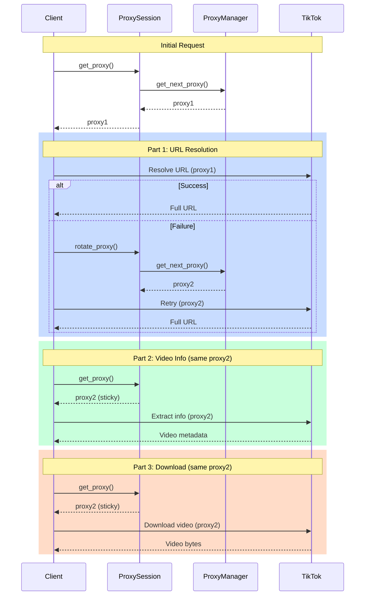

TT-Bot implements a sophisticated 3-part retry strategy that retries each stage of video extraction independently with automatic proxy rotation. This design maximizes success rate while minimizing wasted bandwidth.

## Overview

The extraction flow is divided into three independent parts:

1. **Part 1:** URL Resolution (short URLs → full URLs)
2. **Part 2:** Video Info Extraction (metadata via yt-dlp)
3. **Part 3:** Media Download (video/images/audio bytes)

Each part has its own retry counter and rotates to a new proxy on failure.



## ProxySession: Sticky Proxy Pattern

The `ProxySession` class ensures the same proxy is used across all three parts **unless a retry is triggered**:

```python
@dataclass
class ProxySession:
    """Manages proxy state for a single video request flow."""
    
    proxy_manager: Optional[ProxyManager]
    _current_proxy: Optional[str] = None
    _initialized: bool = False

    def get_proxy(self) -> Optional[str]:
        """Get current proxy (lazily initialized)."""
        if not self._initialized:
            self._initialized = True
            if self.proxy_manager:
                self._current_proxy = self.proxy_manager.get_next_proxy()
        return self._current_proxy

    def rotate_proxy(self) -> Optional[str]:
        """Rotate to next proxy (for retries)."""
        if self.proxy_manager:
            old_proxy = self._current_proxy
            self._current_proxy = self.proxy_manager.get_next_proxy()
            logger.debug(f"Rotated: {old_proxy} -> {self._current_proxy}")
        self._initialized = True
        return self._current_proxy
```

**Key behaviors:**
- Proxy is lazily initialized on first `get_proxy()` call
- Same proxy used across all parts unless `rotate_proxy()` is called
- Each retry gets a fresh proxy (instant retry with different IP)

## Part 1: URL Resolution

Resolves short URLs to full URLs with retry:

```python
async def _resolve_url(
    self,
    url: str,
    proxy_session: ProxySession,
    max_retries: Optional[int] = None,
) -> str:
    """Resolve short URLs to full URLs with retry and proxy rotation."""
    
    # Skip resolution for full URLs
    is_short_url = (
        "vm.tiktok.com" in url
        or "vt.tiktok.com" in url
        or "/t/" in url  # www.tiktok.com/t/XXX format
    )
    if not is_short_url:
        return url

    for attempt in range(1, max_retries + 1):
        proxy = proxy_session.get_proxy()
        
        try:
            async with aiohttp.ClientSession() as session:
                async with session.get(url, allow_redirects=True, proxy=proxy) as response:
                    resolved_url = str(response.url)
                    if "tiktok.com" in resolved_url:
                        return resolved_url
        except Exception as e:
            logger.warning(f"URL resolve attempt {attempt}/{max_retries} failed: {e}")

        # Rotate proxy for next attempt (instant retry since different IP)
        if attempt < max_retries:
            proxy_session.rotate_proxy()

    raise TikTokInvalidLinkError("Invalid or expired TikTok link")
```

**Configuration:**
```bash
URL_RESOLVE_MAX_RETRIES=3  # Default: 3 attempts
```

## Part 2: Video Info Extraction

Extracts video metadata using yt-dlp with retry:

```python
async def _extract_video_info_with_retry(
    self,
    url: str,
    video_id: str,
    proxy_session: ProxySession,
    max_retries: Optional[int] = None,
) -> Tuple[dict[str, Any], dict[str, Any]]:
    """Extract video info with retry and proxy rotation."""
    
    for attempt in range(1, max_retries + 1):
        proxy = proxy_session.get_proxy()
        
        try:
            # Run sync yt-dlp extraction in executor
            video_data, status, download_context = await self._run_sync(
                self._extract_with_context_sync, url, video_id, proxy
            )

            # Check for permanent errors - don't retry these
            if status in ("deleted", "private", "region"):
                self._raise_for_status(status, url)

            # Check for transient errors - retry these
            if status and status not in ("ok", None):
                raise TikTokExtractionError(f"Extraction failed: {status}")

            if video_data and download_context:
                return video_data, download_context

        except (TikTokDeletedError, TikTokPrivateError, TikTokRegionError):
            # Permanent errors - don't retry
            raise

        except Exception as e:
            last_error = e

        # Rotate proxy for next attempt
        if attempt < max_retries:
            proxy_session.rotate_proxy()

    raise TikTokExtractionError(f"Failed after {max_retries} attempts")
```

**Permanent errors (not retried):**
- `TikTokDeletedError` - Video deleted (status 10204, 10216)
- `TikTokPrivateError` - Private video (status 10222)
- `TikTokRegionError` - Geo-blocked

**Transient errors (retried with new proxy):**
- `TikTokNetworkError` - Connection failures
- `TikTokExtractionError` - Extraction failures
- `TikTokRateLimitError` - Rate limiting

**Configuration:**
```bash
VIDEO_INFO_MAX_RETRIES=3  # Default: 3 attempts
```

## Part 3: Media Download

Downloads actual media bytes (video, images, or audio) with retry:

### Video Download

```python
async def _download_video_with_retry(
    self,
    video_url: str,
    download_context: dict[str, Any],
    proxy_session: ProxySession,
    duration: Optional[int] = None,
    max_retries: Optional[int] = None,
) -> bytes:
    """Download video with retry and proxy rotation."""
    
    for attempt in range(1, max_retries + 1):
        proxy = proxy_session.get_proxy()
        context_with_proxy = {**download_context, "proxy": proxy}
        
        try:
            # Use single CDN attempt per proxy
            result = await self._download_media_async(
                video_url,
                context_with_proxy,
                duration=duration,
                max_retries=1,  # Single attempt per proxy
            )

            if result is not None:
                return result

        except Exception as e:
            last_error = e

        # Rotate proxy for next attempt
        if attempt < max_retries:
            proxy_session.rotate_proxy()

    raise TikTokNetworkError(f"Failed to download video after {max_retries} attempts")
```

### Slideshow Download (Individual Image Retry)

For slideshows, each image is retried independently:

```python
async def download_slideshow_images(
    self,
    video_info: VideoInfo,
    proxy_session: ProxySession,
    max_retries: Optional[int] = None,
) -> list[bytes]:
    """Download all slideshow images with individual retry per image."""
    
    image_urls = video_info.image_urls
    
    async def download_image_with_retry(url: str, index: int) -> bytes:
        """Download single image with independent retry."""
        for attempt in range(1, max_retries + 1):
            proxy = proxy_session.get_proxy() if attempt == 1 else proxy_session.rotate_proxy()
            context_with_proxy = {**video_info._download_context, "proxy": proxy}
            
            try:
                result = await self._download_media_async(
                    url,
                    context_with_proxy,
                    max_retries=1,
                )
                if result is not None:
                    return result
            except Exception as e:
                if attempt == max_retries:
                    raise TikTokNetworkError(f"Image {index+1} failed after {max_retries} attempts")
        
        raise TikTokNetworkError(f"Image {index+1} download failed")

    # Download all images in parallel with individual retry
    results = await asyncio.gather(
        *[download_image_with_retry(url, i) for i, url in enumerate(image_urls)],
        return_exceptions=False,  # Fail fast if any image fails
    )
    
    return results
```

**Key difference:** Failed images retry independently, not the entire batch.

**Configuration:**
```bash
DOWNLOAD_MAX_RETRIES=3  # Default: 3 attempts per image
```

## Retry Flow Example



## Configuration Summary

All retry limits are configurable via environment variables:

```bash
# Part 1: URL Resolution
URL_RESOLVE_MAX_RETRIES=3

# Part 2: Video Info Extraction
VIDEO_INFO_MAX_RETRIES=3

# Part 3: Media Download
DOWNLOAD_MAX_RETRIES=3
```

Defaults are defined in `data/config.py`:

```python
"retry": {
    "url_resolve_max_retries": int(os.getenv("URL_RESOLVE_MAX_RETRIES", 3)),
    "video_info_max_retries": int(os.getenv("VIDEO_INFO_MAX_RETRIES", 3)),
    "download_max_retries": int(os.getenv("DOWNLOAD_MAX_RETRIES", 3)),
}
```

## Benefits of 3-Part Strategy

1. **Independent retry counters** - Each stage gets full retry budget
2. **Instant retry** - Proxy rotation = different IP, no backoff needed
3. **Bandwidth efficiency** - Don't re-download video if only info extraction failed
4. **Granular image retry** - Slideshows retry per-image, not entire batch
5. **Sticky proxy** - Same proxy across parts unless failure (reduces proxy churn)
6. **Permanent error detection** - Don't waste retries on deleted/private videos

## Related Components

- [Proxy Rotation](/architecture/proxy-rotation) - How proxies are selected and rotated
- [Media Processing](/architecture/media-processing) - What happens after successful download
- **Source:** `tiktok_api/client.py:640-1360` (retry methods)
